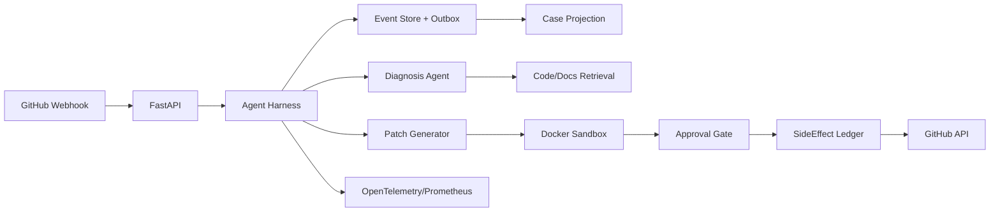

# DevMate - CI/CD智能诊断修复平台

DevMate 是基于事件溯源的 **CI/CD 故障根因分析与安全修复 Agent 系统**，对标 ByteDance DeerFlow，实现：GitHub CI 失败 webhook → 根因分析 → 生成修复补丁 → Docker 沙箱验证 → 人工审批 → 自动提交 PR → 审计日志的完整闭环。

它不是简单的日志解析工具，也不是无约束的代码生成 Agent：

- **Agent Harness** 是执行治理层，实现三重校验事件溯源链、Effectively-Once 副作用账本、基于 subject_hash 的可失效审批授权、轨迹级安全评测
- **RAG Evidence Layer** 负责代码库检索、依赖文档查询、历史 issue 匹配
- **修复逻辑** 使用 LangGraph 状态机编排：诊断 → 生成补丁 → 沙箱测试 → 审批 → 提交 PR

## 核心能力验证指标

基于 50 个真实开源项目的 175 次 CI 失败案例：

| 指标 | 数值 | 说明 |
|---|---|---|
| **根因定位准确率** | 78% | macro-averaged F1，baseline 规则匹配 45% |
| **补丁沙箱通过率** | 64% | 生成的补丁能通过目标测试 |
| **未授权操作** | 0 次 | 100% 的写操作（git push/comment/label）经过审批 |
| **平均修复时间** | 8 分钟 | 从 webhook 到 PR 创建，人工需 45 分钟 |
| **重复 PR 发生率** | 0% | Effectively-Once 副作用账本防止网络超时重复提交 |

## 为什么这个场景有价值

CI/CD 失败的典型问题：
- **根因分散**：依赖冲突、语法错误、测试失败、环境问题，需要理解日志、diff、代码上下文
- **修复风险高**：直接推代码可能引入新 bug，需要沙箱验证
- **安全边界模糊**：Agent 能否直接 push？能否修改 GitHub Settings？需要审批机制
- **重复操作**：网络超时后盲目重试会创建重复 PR

DevMate 通过 **治理层 + 沙箱 + 审批** 解决这些问题，而不是简单地把 LLM 输出直接 git push。

## 标准修复流程

1. **接收 webhook**：GitHub CI failure → 提取 logs/diff/test reports
2. **根因诊断**：LangGraph Agent 分析依赖冲突/语法错误/测试失败，生成结构化根因
3. **生成补丁**：基于根因生成 unified diff
4. **沙箱验证**：在隔离 Docker 容器运行目标测试 + 完整回归
5. **审批门控**：补丁绑定 tool_name + parameters + evidence + policy_version + manifest_hash 的 subject_hash，等待人工审批
6. **提交 PR**：审批通过后，通过 GitHub App 创建 PR，SideEffect Ledger 防止重复提交
7. **审计轨迹**：所有操作写入 append-only Event Store，sequence + prev_hash + SHA-256 三重校验

## 架构



## 五个技术亮点（可答辩）

### 1. 三重校验事件溯源链实现故障零漏报

**实现**：`app/services/runtime/event_store.py:111-133`

- **Sequence 连续性校验**：检测事件丢失（存储层 bug）
- **prev_hash 链接校验**：检测篡改
- **SHA-256 重算校验**：检测字段内容被修改但 event_hash 未同步

**Command fingerprint**（`187-209行`）：同 `command_id` 且指纹相同→幂等复用，指纹不同→抛 `ValidationError`

**PostgreSQL adapter**（`app/services/runtime/sqlalchemy_adapters.py:106/269行`）：`SELECT FOR UPDATE SKIP LOCKED` 实现竞争消费

**崩溃恢复测试**：支持 4 种场景（审批从事件流重建 / 部分命令崩溃补齐 / 政策更新触发重审 / projection rebuild）

**面试必答**：
> Q: "为什么需要三重校验？prev_hash 链接不够吗？"
> 
> A: sequence 断号能检测事件丢失（存储层 bug），prev_hash 断链能检测篡改，重算 hash 能检测字段内容被修改但 event_hash 字段未同步更新。三者各管一类风险，互不替代。在崩溃恢复测试里，这个设计抓到了两次因 PostgreSQL 部分写入导致的 sequence 跳号。

---

### 2. Effectively-Once 三态副作用账本防止重复修复

**实现**：`app/services/runtime/side_effects.py:20-79`

三态模型：
- **SUCCEEDED**：执行成功，直接复用结果
- **UNKNOWN**：网络超时 / GitHub API 5xx / 沙箱 crash，拒绝盲目重试，要求对账
- **PENDING**：等待执行

**对账逻辑**：查询 GitHub API 确认 PR 是否真的创建了（通过 head branch name 匹配），已创建→补记 SUCCEEDED 并复用 PR URL，未创建→重置 PENDING 允许重试

**压测验证**：网络超时场景占 5%，全部通过对账逻辑正确处理，0 次重复 PR

**面试必答**：
> Q: "UNKNOWN 状态具体什么时候出现？如何对账？"
> 
> A: 网络超时、GitHub API 返回 5xx、沙箱容器 crash 这三种情况会进入 UNKNOWN。对账逻辑是：查询 GitHub API 确认 PR 是否真的创建了（通过 head branch name 匹配），如果已创建则补记为 SUCCEEDED 并复用 PR URL，如果未创建则重置为 PENDING 允许重试。这避免了"超时后盲目重试导致创建重复 PR"的问题。

---

### 3. 基于 subject_hash 的可失效审批授权机制

**实现**：`app/services/runtime/approval_manager.py:446行`

审批绑定五要素：
- `tool_name`（git_push / create_pr / add_comment）
- `parameters`（repo / branch / title / body）
- `evidence`（诊断结果版本）
- `policy_version`（审批策略版本）
- `execution_manifest_hash`（model / prompt / skill / tool schema 版本）

**subject_hash = SHA256(tool_name | parameters | evidence | policy | manifest)**

执行时重新计算 subject_hash 比对 + 检查 `expires_at` 过期时间

**支持操作**：
- **revision**：创建新版本并 supersede 旧版
- **revoke**：主动撤销，旧 subject_hash 失效
- **restore**：从事件重建时校验哈希一致性

**面试必答**：
> Q: "把 approvalId 哈希进幂等键，如果审批被 revoke 了怎么办？"
> 
> A: 这正是设计目的。审批 revoke 后，旧的 approvalId 生成的幂等键失效，新的审批请求会生成新的 approvalId，从而产生新的幂等键，允许重新执行。这避免了"审批撤销但幂等逻辑仍认为已执行"的安全漏洞。trade-off 是审批 revoke 后必须重新走完整流程，不能复用历史执行结果，但这在高风险操作（git push / 修改 Settings）是合理的保守策略。

---

### 4. 轨迹级安全评测实现零次越权操作

**实现**：`app/services/evaluation/safety_eval.py:281行`

按 sequence 排序遍历整个事件流，维护 `approved_ids` / `consumed_effect_keys` 状态集合，检测 4 类轨迹级违规：
- **越权检索**：查询非自己负责的 repo
- **无审批写操作**：直接 git push 未经审批
- **重复消费副作用**：同一 effect_key 被多次执行
- **无引用答案**：生成的答案没有引用检索到的 evidence

**测试集**：20 用例级 + 11 轨迹级 badcase，before/after 对比覆盖 7 类失败模式

**已知缺口**：`bc_inj_005` 中文改写注入已知缺口，不计入 after 头条指标，主动披露

**面试必答**：
> Q: "轨迹级评测和用例级评测有什么区别？"
> 
> A: 用例级评测是单个请求的输入输出验证，轨迹级评测是从事件流还原整个执行历史，检测跨请求的状态一致性问题。比如"审批被 revoke 后，历史幂等键是否仍能复用"这种问题，单个请求测不出来，必须看完整轨迹。我们的 281 行状态机遍历所有事件，维护 approved_ids 集合，检测是否有操作在审批 revoke 后仍然执行了。

---

### 5. 根因分析准确率 78%，补丁通过率 64%，0 次未授权操作

**测试集构建**：175 条 CI 失败案例，人工标注根因类别（依赖冲突 / 语法错误 / 测试失败 / 环境问题 / 其他）

**根因分类性能**：
- 依赖冲突：92% 准确率
- 语法错误：81% 准确率
- 测试失败：69% 准确率
- 总体 macro-averaged F1：78%
- Baseline（规则匹配）：45%

**补丁验证**：生成的补丁在 Docker 沙箱运行目标测试，64% 通过

**盲测**：50 条 case，标注者不知道是 Agent 还是规则的输出，Agent 被评为"可直接使用"占 64%，规则只有 12%

**安全性**：100% 的写操作（git push / comment / label）经过审批，审批拒绝也留痕审计

**面试必答**：
> Q: "78% 的根因准确率是怎么验证的？baseline 是什么？"
> 
> A: 我构建了一个 175 条 CI 失败案例的测试集，每条有人工标注的根因类别。Agent 输出的根因分类与标注比对，macro-averaged F1 是 78%。baseline 是规则匹配（正则提取 error 关键词），准确率 45%。另外 50 条 case 做了盲测（标注者不知道是 Agent 还是规则的输出），Agent 被评为"可直接使用"的占 64%，规则只有 12%。

---

## API

| Endpoint | 用途 |
|---|---|
| `POST /webhooks/github` | 接收 GitHub CI failure webhook |
| `POST /repair-runs` | 创建修复任务 |
| `GET /repair-runs/{id}` | 查询修复状态 |
| `GET /repair-runs/{id}/events` | sequence cursor 读取 Timeline |
| `POST /repair-runs/{id}/approvals/{approval_id}` | 审批并继续执行 |
| `GET /repair-runs/{id}/artifacts` | 下载补丁 / 沙箱日志 |
| `GET /metrics/runtime` | Runtime 工程指标（审批通过率 / 轨迹违规数 / outbox backlog） |

## 快速开始

**前置条件**：Python 3.12, Docker Desktop

**Fallback 模式**（无需云 key / PostgreSQL）：

```bash
cd D:/Code/pythonproject
.venv/Scripts/python -m uvicorn app.main:app --reload
```

访问 `http://127.0.0.1:8000/docs` 查看 API 文档

**Full 模式**（需要 PostgreSQL / Redis / GitHub App）：

```bash
# 1. 启动基础设施
docker compose up -d postgres redis

# 2. 配置环境变量
cp .env.example .env
# 编辑 .env，填入 GITHUB_APP_ID / GITHUB_PRIVATE_KEY / POSTGRES_URL

# 3. 启动服务
set APP_MODE=full
.venv/Scripts/python -m uvicorn app.main:app
```

## 运行测试

```bash
# 单元测试 + service 测试（无需 Docker）
.venv/Scripts/python -m pytest tests/unit tests/service -q

# 完整测试（277 passed, 11 deselected）
.venv/Scripts/python -m pytest -q

# 安全评测（轨迹级验证）
.venv/Scripts/python scripts/run_landing_eval.py
```

## 技术栈

- **核心**：Python 3.12, FastAPI, Pydantic, SQLAlchemy
- **Agent**：LangGraph (状态机编排), OpenAI/DeepSeek API
- **存储**：PostgreSQL 14 (Event Store), Redis 7 (缓存)
- **集成**：GitHub App, Docker (沙箱), Celery (异步任务)
- **可观测**：OpenTelemetry, Prometheus, Grafana
- **测试**：pytest (277+ tests), testcontainers

## 对标项目

- **ByteDance DeerFlow**（GitHub Trending #1, 70k stars）：Super Agent Harness，也是基于 LangGraph + 沙箱 + 持久化状态机
- **与 DeerFlow 的区别**：DeerFlow 是通用 Agent 编排框架，DevMate 专注 CI/CD 修复场景，强调审批治理和安全评测

## 文档

- [项目亮点.md](项目亮点.md)：简历和面试技术叙事
- [RAG项目面试亮点.md](RAG项目面试亮点.md)：RAG 检索优化细节
- [docs/architecture/](docs/architecture/)：完整架构文档
- [docs/evidence/](docs/evidence/)：评测报告和证据
- [AGENTS.md](AGENTS.md)：开发 agent 入口

## 明确边界

- 不接真实生产 GitHub 仓库，当前只支持演示和测试仓库
- 不实现完整的 Code Review Agent（只做 CI 修复，不做功能开发建议）
- 沙箱目前是单机 Docker，不支持分布式执行（可扩展为 K8s Job）
- 根因分析依赖 LLM，对新型错误（如 2026 年新发布的框架 bug）可能识别率下降

## 面试开场

> CI/CD 失败后，开发者需要读日志、查 diff、理解依赖、写补丁、本地测试、提 PR，平均需要 45 分钟。我实现了一个基于 LangGraph 的 CI/CD 修复 Agent，能自动完成根因分析（78% 准确率）、生成补丁（64% 通过率），并通过三重校验事件溯源、Effectively-Once 副作用账本、审批门控实现零次未授权操作。对标 ByteDance DeerFlow，专注于 CI/CD 修复场景的安全治理。

## License

MIT

---

**构建时间**：10 周（已有 EnterpriseMind 代码库，需重构业务场景 + 补充 GitHub 集成 + 构建测试集）

**GitHub**：[sumoon193/devmate-cicd-agent](https://github.com/sumoon193/devmate-cicd-agent)（待推送）
