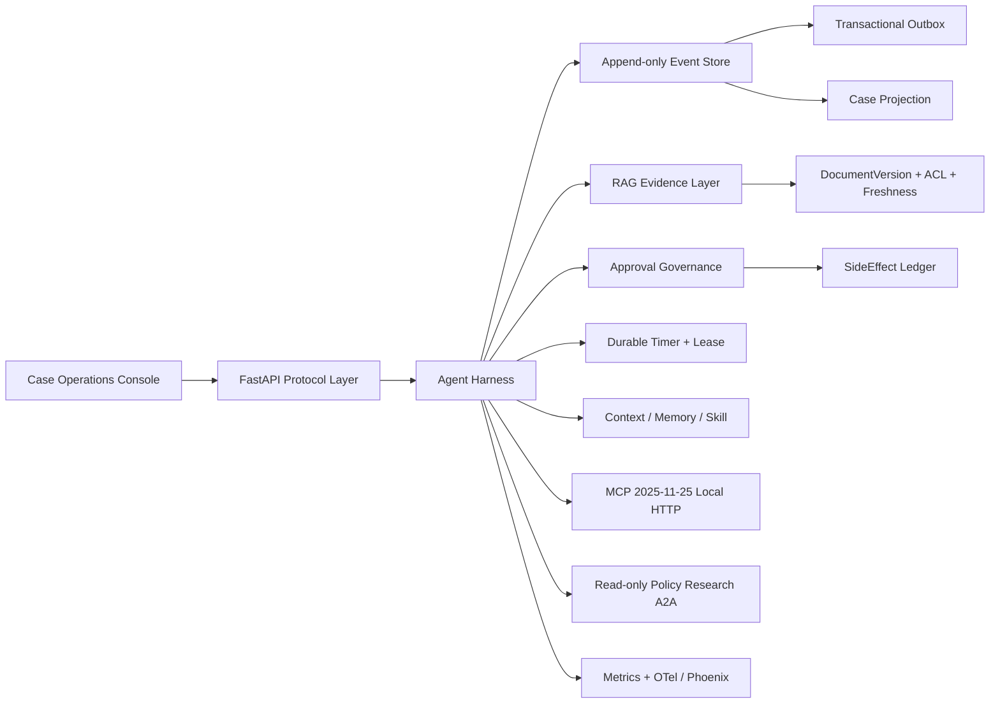

# EnterpriseMind Agent Runtime

EnterpriseMind 是面向企业内部制度型长流程的 **Agent Runtime 与执行治理平台**。HR Shared Service 是首个 Reference Application，用“新员工入职到转正”的跨天 Case 验证证据检索、计划、人工审批、权限控制、故障恢复、幂等副作用、持久定时器和审计能力。

它不是 HR Chatbot，也不是把 LLM 套在固定 BPM 上：

- RAG 是可信证据层，负责版本化制度、ACL 检索、重排、引用与 evidence freshness。
- Agent Harness 是执行治理层，负责 Case/Run、PLAN-ACT-OBSERVE-REFLECT-REPAIR、工具风险、审批、checkpoint、side-effect ledger、timer、memory、Skill、protocol 和 safety eval。
- HR 逻辑只位于 Skill、制度文档、工具 adapter 和评测数据；Runtime 使用通用的 `Case`、`Run`、`Event`、`Approval`、`Tool`、`Timer`、`Memory`、`Skill`、`Artifact` 抽象。

## 为什么这个场景有落地价值

企业入职、转正、调岗、请假和报销有相同的工程难题：制度分散且有版本/适用范围，流程跨 HR、主管、员工和 IT，持续数天或数月，包含 SLA、审批和外部系统写操作，并要求回答“为什么这样执行、引用了什么、谁批准了什么”。

传统 RAG 只能回答“应该怎么办”；传统 workflow 只能执行预编码的固定路径。EnterpriseMind 用 RAG 理解非结构化制度，用 deterministic Harness 约束 Agent 的执行权。

## 标准 Case

1. 创建 `HRCase`，固定 `ExecutionManifest`。
2. 加载通过评测门禁的 `hr_onboarding` Skill。
3. 通过只读 A2A Policy Research Agent 研究制度，返回版本化 evidence artifact。
4. 生成跨 HR、IT、主管和 Harness 的计划。
5. MCP 写工具准备创建工单，在执行前生成绑定参数、证据版本、policy version 和 manifest hash 的审批。
6. Case 暂停为 `waiting_approval`，结构化 Context Snapshot 保留治理不变量。
7. 人工批准后恢复，执行前重新校验授权，SideEffect Ledger 保证 effectively-once。
8. 写入 episodic memory，并调度可恢复的试用期 `DurableTimer`。
9. 所有动作形成 append-only Artifact Timeline，可通过 sequence cursor/SSE 断线续读。

## 架构



完整说明见 [工业化架构文档](docs/architecture/enterprise-agent-runtime-v2.md) 和 [模块 15 规范](docs/modules/15-AgentRuntime长期Case与协议治理.md)。

## 已实现能力

### Runtime Kernel

- Append-only Event Store、单调 sequence、optimistic version、命令幂等和 SHA-256 hash chain。
- event/outbox 同事务写入；outbox claim、超时回收、ack 和 backlog 指标。
- PostgreSQL/SQLAlchemy 与 in-memory fake 使用同一 async Protocol。
- 幂等 Case projection、重启恢复和 projection rebuild。
- run lease + fencing token、durable timer 单次 claim。

### Execution Governance

- 审批 revision、expiry、revoke、supersede、subject hash、policy/manifest/evidence 绑定。
- admin maker-checker；审批通过不等于越权，恢复执行前重新授权。
- SideEffect Ledger 的 reservation/succeeded/unknown 状态与 reconciliation 边界。
- `ExecutionManifest` 固定 model、prompt、Skill、tool schema、policy、retrieval、context 和 code 版本。

### Context, Memory, Skill

- write/select/compress/isolate 的结构化 Context Snapshot，原始事件永不删除。
- 未决审批边界与 governance event pinning，压缩前后 invariant hash 校验。
- tenant-isolated episodic memory、provenance、prompt injection quarantine 和 forget。
- Skill source allowlist、checksum、eval promotion gate、draft/active/deprecated/revoked 生命周期。

### RAG Evidence

- Markdown/Plain Text/Office fallback 入库、Celery 可选异步执行。
- SHA-256 稳定 chunk ID、不可变 `DocumentVersion`、active-version 检索过滤。
- Dense + BM25 + RRF + reranker、ACL 下推、citations 和 evidence freshness。
- Qwen chat / `text-embedding-v4` / `qwen3-rerank` adapters；无 key 时 deterministic fake。

### Protocol and Safety

- 本地 Streamable HTTP 风格 MCP 2025-11-25：initialize、tools、resources、prompts、structured output。
- A2A AgentCard、Task、Message、Artifact；Policy Research Agent 独立只读权限域。
- 真实 trajectory Safety Eval：越权检索、审批绕过、重复副作用、缺失引用。
- OTel/Phoenix 关联 `case_id/run_id/event_id`；Runtime metrics 暴露审批、协议、projection 和安全零值。

## API

| Endpoint | 用途 |
| --- | --- |
| `POST /cases` | 创建长期 Case |
| `GET /cases` | Case 运维队列 |
| `POST /cases/{id}/start` | 启动 HR Reference workflow |
| `POST /cases/{id}/approvals/{approval_id}` | 审批并恢复 |
| `POST /cases/{id}/policies/refresh` | 制度更新后重建 evidence/plan/approval |
| `GET /cases/{id}/events` | sequence cursor 读取 Timeline |
| `GET /cases/{id}/stream` | 可断线续读 SSE |
| `POST /mcp` | MCP JSON-RPC |
| `GET /.well-known/agent-card.json` | A2A AgentCard |
| `POST /a2a/tasks` | 只读制度研究任务 |
| `GET /metrics/runtime` | Runtime 工程指标 |

原有 `/agent-runs`、文档入库、评测、health API 继续保留。

## 运行

默认 fallback 不需要 Docker、云 key 或外部网络：

```powershell
.\.venv\Scripts\python.exe -m uvicorn app.main:app --reload
cd frontend
npm run dev
```

打开 `http://127.0.0.1:5173`。`/` 是 Case 运维台，`/runs` 是兼容的单轮 Agent Run 实验台。

full mode 使用 PostgreSQL、Redis、Milvus、Elasticsearch、MinIO，并可开启 Qwen、Celery、LangGraph 和 Phoenix：

```powershell
$env:APP_MODE='full'
.\.venv\Scripts\python.exe -m uvicorn app.main:app
```

配置项见 `.env.example` 和 `docker-compose.yml`。

## Checkpoint、Event Store 与 Projection

- LangGraph checkpoint 只保存执行位置；默认 `GRAPH_CHECKPOINTER_BACKEND=memory`。
- 跨进程恢复设置 `GRAPH_CHECKPOINTER_BACKEND=postgres`，连接串优先读取 `GRAPH_CHECKPOINTER_POSTGRES_URL`，为空时复用 `POSTGRES_URL`。
- Event Store 保存不可变业务事实，Projection 服务查询/UI；两者不由 checkpoint 替代。
- PostgreSQL saver 在 FastAPI lifespan 内建表、打开和关闭连接池，单元测试仍不依赖数据库。

## 验证

```powershell
.\.venv\Scripts\python.exe -m pytest tests\unit tests\service tests\api -q -p no:cacheprovider --basetemp runtime_pytest_v2
.\.venv\Scripts\python.exe -m compileall -q app tests scripts
cd frontend
.\node_modules\.bin\vue-tsc.cmd -b
npm run build
npm run test:e2e
```

单元、service 和 API 测试不依赖 Docker、云 key 或外部网络。full-mode integration 需要本地基础设施。

## 明确边界

- 不接真实 HR 系统，不实现工资、考勤或完整 HR SaaS。
- 不实现完整生产多租户 IAM/RBAC；当前 ACL 是可测试的工程边界。
- MCP/A2A 是本地标准形态的 reference implementation，未使用官方 SDK 的完整 session/transport 机制。
- 不引入 Kafka、Temporal、Kubernetes 或 GraphRAG 主链路；这些不是证明 Harness 治理能力的必要条件。

## 面试开场

> 企业内部很多流程不是简单问答，而是由非结构化制度驱动、跨角色和跨天运行，并包含有副作用的系统操作。普通 RAG 只能回答，普通 workflow 又无法理解制度和处理例外。我实现了一个以 RAG 为证据层、以 Agent Harness 为治理层的企业流程 Agent Runtime，并用员工入职到转正的长期 Case 验证审批、恢复、幂等、记忆、协议和安全评测。

## 文档

- `AGENTS.md` / `CLAUDE.md`：开发 agent 入口与当前状态。
- `项目亮点.md`：简历和面试技术叙事。
- `开发规划.md`：历史 16 阶段与 Runtime 深化阶段。
- `docs/CODING_STANDARDS.md`：代码规范。
- `docs/modules/00-模块规范总览.md`：模块规范入口。
- `docs/DECISIONS.md`：关键产品与技术决策。
